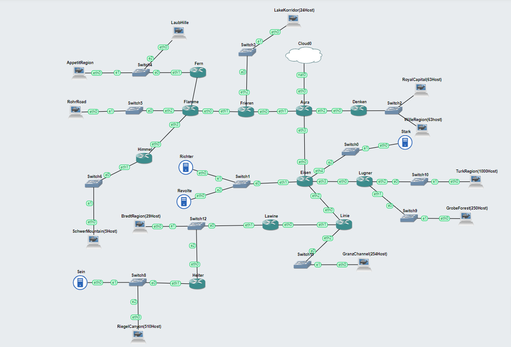
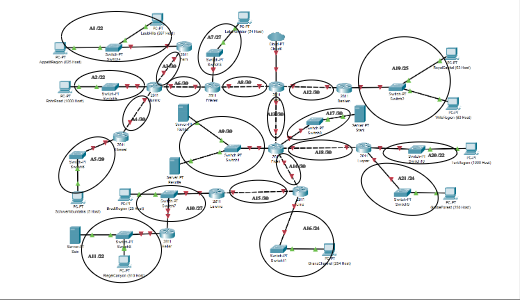
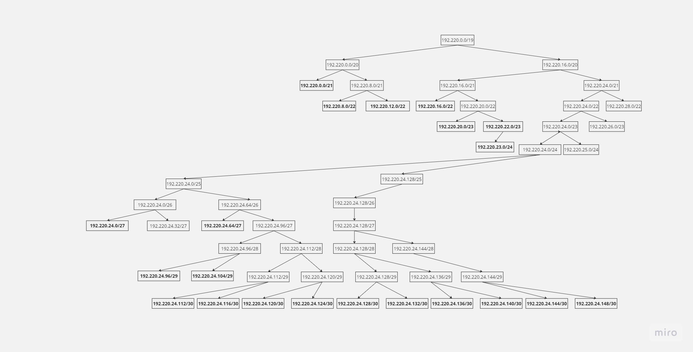
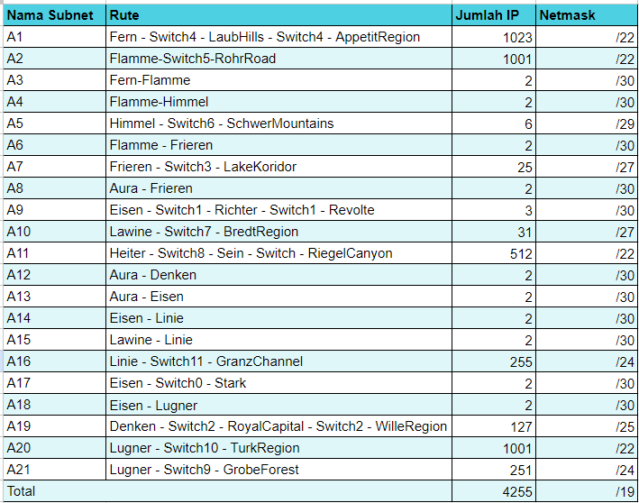
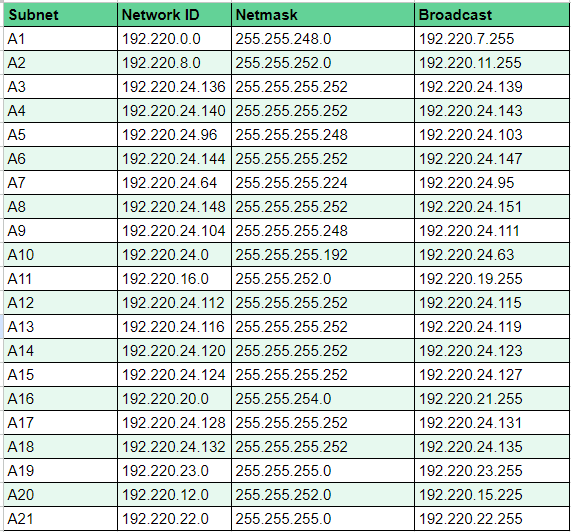
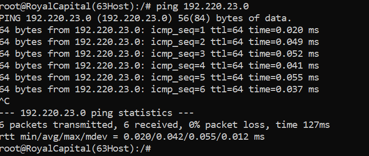

# Jarkom-Modul-4-E28-2023

## Kelompok E28
- Shafa Nabilah Hanin / 5025211222
- Nizam Hakim Santoso / 5025211209

# Lapres Praktikum 4
## Daftar Isi
- [CPT / CIDR]()
    - [Topologi]()
    - [Merging Subnet]()
    - [Subnet Tree]()
    - [Spreadsheet Subnet]()
    - [Testing]()
- [GNS3 / VLSM]()
    - [Topologi]()
    - [Subnet Tree]()
    - [Testing]()

## CPT / CIDR
### Topologi
Penamaan subnet yang kami gunakan untuk topologi metode CIDR adalah sebagai berikut:  


### Merging Subnet
Langkah-langkah penggabungan subnet untuk menentukan subnet terbesar kami jabarkan pada canva seperti berikut:

  

  

  

  

  

  

  

  

  

  

  

  

  

  

  

  

  

didapatkan length tertinggi /14

Dokumen lengkap ada di: [Canva](https://www.canva.com/design/DAF1klu-Ybg/hjfjVTfJBfJlFuXL9a1-SQ/edit?utm_content=DAF1klu-Ybg&utm_campaign=designshare&utm_medium=link2&utm_source=sharebutton) dan [Spreadsheet](https://docs.google.com/spreadsheets/d/1EBKF3tDHpHjzHjmlIIN7Yl3tEOGVCPE1RmuB9RrNEj8/edit?usp=sharing)

### Subnet Tree
Setelah merging kembalikan subnet-subnet sesuai dengan length awalnya dengan tree sebagai berikut:


Dokumen lengkap ada di: [Canva](https://www.canva.com/design/DAF1tzOU0JI/D065NM6o1WV48q73KsWPQQ/edit?utm_content=DAF1tzOU0JI&utm_campaign=designshare&utm_medium=link2&utm_source=sharebutton)

### Spreadsheet Subnet
Data kelengkapan IP dipetakan dalam spreadsheet sebagai berikut:


Connection pair untuk tiap-tiap router dipetakan dalam spreadsheet sebagai berikut:


Dokumen lengkap ada di: [Spreadsheet](https://docs.google.com/spreadsheets/d/1EBKF3tDHpHjzHjmlIIN7Yl3tEOGVCPE1RmuB9RrNEj8/edit?usp=sharing)

### Testing
Lakukan testing dengan melakukan beberapa ping seperti berikut dalam mode simulasi.


Hasil:


## GNS3 / VLSM
### Topologi




### Subnet Tree






### Configuration
## Network Configuration
Aura

```
auto lo
iface lo inet loopback

auto eth0
iface eth0 inet dhcp

#A8
auto eth1
iface eth1 inet static
address 192.220.24.148
netmask 255.255.255.252

#A12
auto eth2
iface eth2 inet static
address 192.220.24.112
netmask 255.255.255.252

#A13
auto eth3
iface eth3 inet static
address 192.220.24.116
netmask 255.255.255.252

```

Denken

```
auto lo
iface lo inet loopback

#A12
auto eth0
iface eth0 inet static
address 192.220.24.112
netmask 255.255.255.252
gateway 192.220.24.113

#A19
auto eth1
iface eth1 inet static
address 192.220.23.0
netmask 255.255.255.0

```

Frieren

```
auto lo
iface lo inet loopback

#A8
auto eth0
iface eth0 inet static
address 192.220.24.148
netmask 255.255.255.252
gateway 192.220.24.150

#A6
auto eth1
iface eth1 inet static
address 192.220.24.144
netmask 255.255.255.252

#A7
auto eth2
iface eth2 inet static
address 192.220.24.64
netmask 255.255.255.224
```

Fern

```
auto lo
iface lo inet loopback

#A3
auto eth0
iface eth0 inet static
address 192.220.24.136
netmask 255.255.255.252
gateway 192.220.24.138

#A1
auto eth1
iface eth1 inet static
address 192.220.0.0
netmask 255.255.248.0
```

Flamme

```
auto lo
iface lo inet loopback

#A6
auto eth0
iface eth0 inet static
address 192.220.24.144
netmask 255.255.255.252
gateway 192.220.24.146

#A3
auto eth1
iface eth1 inet static
address 192.220.24.136
netmask 255.255.255.252

#A2
auto eth2
iface eth2 inet static
address 192.220.8.0
netmask 255.255.252.0

#A4
auto eth3
iface eth3 inet static
address 192.220.24.140
netmask 255.255.255.252
```

Himmel

```
auto lo
iface lo inet loopback

#A44
auto eth0
iface eth0 inet static
address 192.220.24.140
netmask 255.255.255.252
gateway 192.220.24.143

#A5
auto eth1
iface eth1 inet static
address 192.220.24.96
netmask 255.255.255.248
```

Eisen

```
auto lo
iface lo inet loopback

#A13
auto eth0
iface eth0 inet static
address 192.220.24.116
netmask 255.255.255.252
gateway 192.220.24.119

#A9
auto eth1
iface eth1 inet static
address 192.220.24.104
netmask 255.255.255.248

#A14
auto eth2
iface eth2 inet static
address 192.220.24.120
netmask 255.255.255.252

#A18
auto eth3
iface eth3 inet static
address 192.220.24.132
netmask 255.255.255.252

#A17
auto eth4
iface eth4 inet static
address 192.220.24.128
netmask 255.255.255.252
```

Lugner

```
auto lo
iface lo inet loopback

#A18
auto eth0
iface eth0 inet static
address 192.220.24.132
netmask 255.255.255.252
gateway 192.220.24.134

#A21
auto eth1
iface eth1 inet static
address 192.220.22.0
netmask 255.255.255.0

#A20
auto eth2
iface eth2 inet static
address192.220.12.0
netmask 255.255.252.0
```

Lawine

```
auto lo
iface lo inet loopback

#A15
auto eth0
iface eth0 inet static
address 192.220.24.124
netmask 255.255.255.252
gateway 192.220.24.126

#A10
auto eth1
iface eth1 inet static
address 192.220.24.0
netmask 255.255.255.192
```

Linie

```
auto lo
iface lo inet loopback

#A14
auto eth0
iface eth0 inet static
address 192.220.24.120
netmask 255.255.255.252
gateway 192.220.24.122

#A15
auto eth1
iface eth1 inet static
address 192.220.24.124
netmask 255.255.254.0

#A16
auto eth2
iface eth2 inet static
address 192.220.20.0
netmask 255.255.255.252
```

Heiter

```
auto lo
iface lo inet loopback

#A10
auto eth0
iface eth0 inet static
address 192.220.24.0
netmask 255.255.255.192
gateway 192.220.24.0

#A11
auto eth1
iface eth1 inet static
address 192.220.16.0
netmask 255.255.252.0
```

LaubHills

```
auto eth0
iface eth0 inet static
address 192.220.0.0
netmask 255.255.248.0
gateway 192.220.0.2
```

LakeKorridor

```
auto eth0
iface eth0 inet static
address 192.220.24.64
netmask 255.255.255.224
gateway 192.220.24.65
```

AppetitRegion

```
auto eth0
iface eth0 inet static
address 192.220.0.0
netmask 255.255.248.0
gateway 192.220.0.1
```

RohrRoad

```
auto eth0
iface eth0 inet static
address 192.220.8.0
netmask 255.255.252.0
gateway 192.220.8.1
```

Royal Capital

```
auto eth0
iface eth0 inet static
address 192.220.23.0
netmask 255.255.255.0
gateway 192.220.23.1
```


WilleRegion

```
auto eth0
iface eth0 inet static
address 192.220.23.0
netmask 255.255.255.0
gateway 192.220.23.2
```

SchwerMountain

```
auto eth0
iface eth0 inet static
address 192.220.24.96
netmask 255.255.255.248
gateway 192.220.24.97
```

BredtRegion

```
auto eth0
iface eth0 inet static
address 192.220.24.0
netmask 255.255.255.192
gateway 192.220.24.1
```

TurkRegion

```
auto eth0
iface eth0 inet static
address 192.220.12.0
netmask 255.255.252.0
gateway 192.220.12.1
```

GrobeForest

```
auto eth0
iface eth0 inet static
address 192.220.22.0
netmask 255.255.255.0
gateway 192.220.22.1
```

GranzChannel

```
auto eth0
iface eth0 inet static
address 192.220.20.0
netmask 255.255.254.0
gateway 192.220.20.1
```

RiegelCanyon

```
auto eth0
iface eth0 inet static
address 192.220.16.0
netmask 255.255.252.0
gateway 192.220.16.1
```

Stark

```
auto eth0
iface eth0 inet static
address 192.220.24.128
netmask 255.255.255.252
gateway 192.220.24.129
```

Richter

```
auto eth0
iface eth0 inet static
address 192.220.24.104
netmask 255.255.255.248
gateway 192.220.24.111
```

Revolte

```
auto eth0
iface eth0 inet static
address 192.220.24.104
netmask 255.255.255.248
gateway 192.220.24.105
```

Sein

```
auto eth0
iface eth0 inet static
address 192.220.16.0
netmask 255.255.252.0
gateway 192.220.16.1
```


## Routing

Denken

```
echo nameserver 192.168.122.1 > /etc/resolv.conf
route add -net 0.0.0.0 netmask 0.0.0.0 gw 192.220.24.113
```

Lugner

```
echo nameserver 192.168.122.1 > /etc/resolv.conf
route add -net 0.0.0.0 netmask 0.0.0.0 gw 192.220.24.134
```

Linie 

```
echo nameserver 192.168.122.1 > /etc/resolv.conf
route add -net 192.220.24.0 netmask 255.255.255.192 gw 192.220.24.127
route add -net 192.220.16.0 netmask 255.255.252.0 gw 192.220.24.127
```

Lawine 

```
echo nameserver 192.168.122.1 > /etc/resolv.conf
route add -net 192.220.16.0 netmask 255.255.252.0 gw 192.220.24.0
```

Heiter

```
echo nameserver 192.168.122.1 > /etc/resolv.conf
route add -net 0.0.0.0 netmask 0.0.0.0 gw 192.220.24.0
```

Himmel

```
echo nameserver 192.168.122.1 > /etc/resolv.conf
route add -net 0.0.0.0 netmask 0.0.0.0 gw 192.220.24.142
```

Flamme

```
echo nameserver 192.168.122.1 > /etc/resolv.conf
route add -net 192.220.24.96 netmask 255.255.255.248 gw 192.220.24.138
route add -net 192.220.0.0 netmask 255.255.248.0 gw 192.220.24.142
```

Fern
```
echo nameserver 192.168.122.1 > /etc/resolv.conf
route add -net 0.0.0.0 netmask 0.0.0.0 gw 192.220.24.138
```

Frieren

```
echo nameserver 192.168.122.1 > /etc/resolv.conf
route add -net 192.220.8.0 netmask 255.255.252.0 gw 192.220.24.146
route add -net 192.220.24.136 netmask 255.255.255.252 gw 192.220.24.146
route add -net 192.220.0.0 netmask 255.255.248.0 gw 192.220.24.146
route add -net 192.220.24.96 netmask 255.255.255.248 gw 192.220.24.146
route add -net 192.220.24.140 netmask 255.255.255.252 gw 192.220.24.146
```

Eisen

```
echo nameserver 192.168.122.1 > /etc/resolv.conf
route add -net 192.220.12.0 netmask 255.255.252.0 gw 192.220.24.132
route add -net 192.220.22.0 netmask 255.255.255.0 gw 192.220.24.132

route add -net 192.220.12.0 255.255.252.0 192.220.24.134
no ip 192.220.22.0 255.255.255.0 192.220.24.134

route add -net 192.220.20.0 netmask 255.255.255.0 gw 192.220.24.122
route add -net 192.220.24.124 netmask 255.255.255.252 gw 192.220.24.122
route add -net 192.220.24.0 netmask 255.255.255.192 gw 192.220.24.122
route add -net 192.220.16.0 netmask 255.255.252.0 gw 192.220.24.122
```

Aura

```
echo nameserver 192.168.122.1 > /etc/resolv.conf

#Frieren
route add -net 192.220.24.64 netmask 255.255.255.224 gw 192.220.24.150
route add -net 192.220.24.144 netmask 255.255.255.252 gw 192.220.24.150
route add -net 192.220.24.136 netmask 255.255.255.252 gw 192.220.24.150
route add -net 192.220.0.0 netmask 255.255.248.0 gw 192.220.24.150
route add -net 192.220.8.0 netmask 255.255.252.0 gw 192.220.24.150
route add -net 192.220.24.148 netmask 255.255.255.252 gw 192.220.24.150
route add -net 192.220.24.96 netmask 255.255.255.248 gw 192.220.24.150

# Denken
route add -net 192.220.23.0 netmask 255.255.255.0 gw 192.220.24.114

# Eisen
route add -net 192.220.24.128 netmask 255.255.255.252 gw 192.220.24.118
route add -net 192.220.24.132 netmask 255.255.255.252 gw 192.220.24.118
route add -net 192.220.12.0 netmask 255.255.252.0 gw 192.220.24.118
route add -net 192.220.22.0 netmask 255.255.255.0 gw 192.220.24.118
route add -net 192.220.24.120 netmask 255.255.255.252 gw 192.220.24.118
route add -net 192.220.20.0 netmask 255.255.254.0 gw 192.220.24.118
route add -net 192.220.24.124 netmask 255.255.255.252 gw 192.220.24.118
route add -net 192.220.24.0 netmask 255.255.255.192 gw 192.220.24.118
route add -net 192.220.16.0 netmask 255.255.252.0 gw 192.220.24.118
route add -net 192.220.24.104 netmask 255.255.255.248 gw 192.220.24.118
```

### Testing

